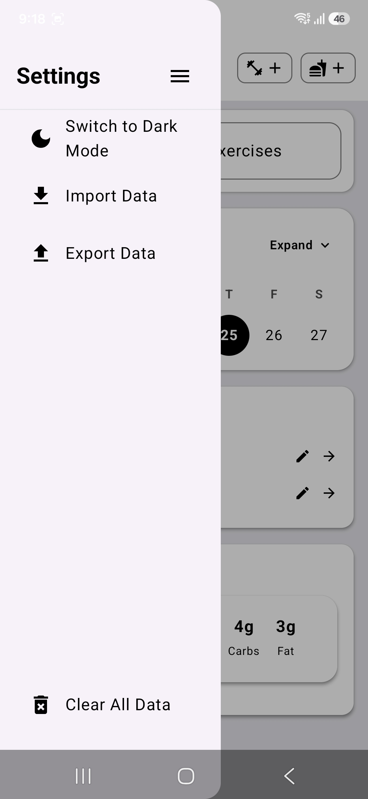

# Training-Nutrition-android

A minimal, focused Android app to track daily workouts and meals — built in Kotlin. Log exercises (sets, weight, reps) and meals (calories + optional macros) quickly with a clean card-based UI.

Status: Draft — screenshots provided by the author.

---

## Table of contents
- Features
- Screenshots
- Tech stack
- Getting started
- Usage
- Project structure (high level)
- Contributing
- Roadmap
- License
- Contact

---

## Features
- Add / edit / delete exercises (sets with weight & reps)
- Add / edit / delete meals (required calories; optional macros: protein, carbs, fat)
- Daily views for Workouts and Meals with simple cards
- Notes fields for both exercises and meals
- Date picker and dashboard summary with nutrition totals
- Light/dark mode toggle (UI supports switching)
- Import / export and clear data options in Settings

---

## Screenshots
| Dashboard | Add Meal | Add Exercise | Meals | Workouts | History | Settings |
|-----------|----------|--------------|--------|----------|---------|----------|
|  |  |  |  |  |  |  |
