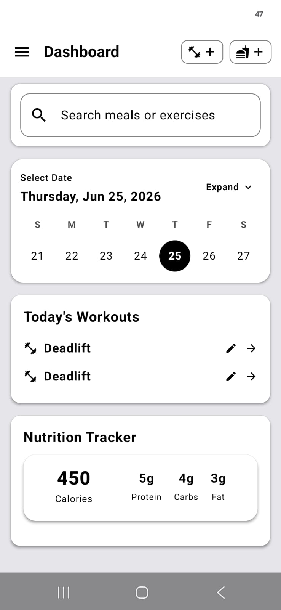
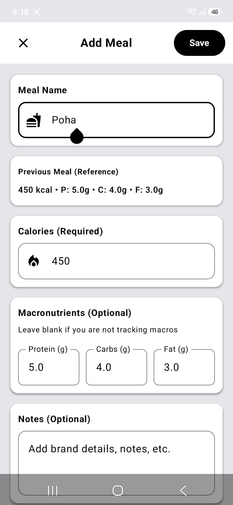
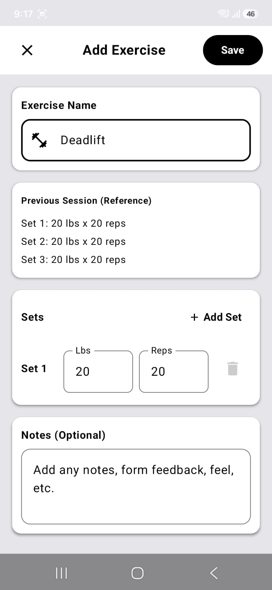
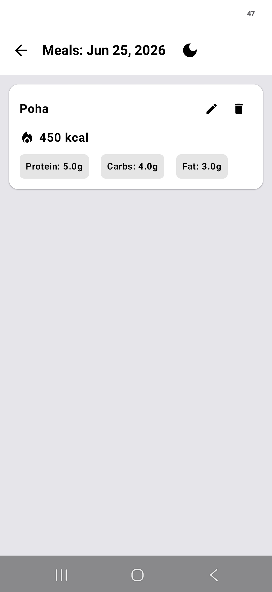
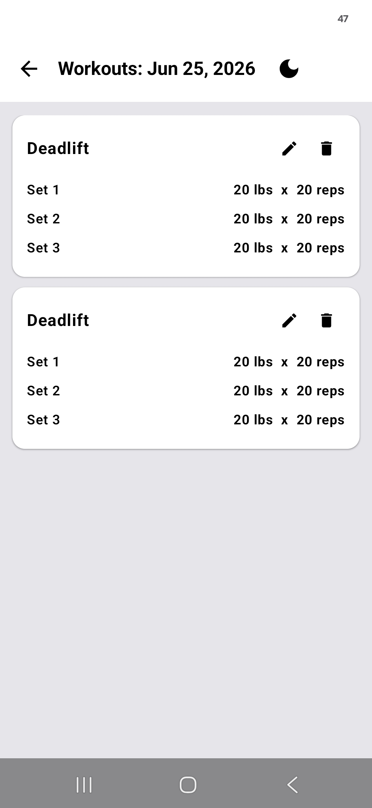
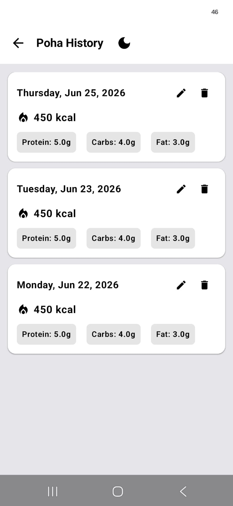

# GymLogs: Training & Nutrition Tracker

A modern, focused Android application designed to streamline your fitness and nutrition tracking. Built with Kotlin and Jetpack Compose, GymLogs offers a clean, card-based interface for logging workouts and meals while keeping your data local and secure.

---

## Table of Contents
- [Features](#features)
- [Screenshots](#screenshots)
- [Tech Stack](#tech-stack)
- [Getting Started](#getting-started)
- [Project Structure](#project-structure)
- [Contributing](#contributing)
- [License](#license)

---

## Features

- **Workout Logging**: Track exercises, sets, weight, and reps with ease.
- **Nutrition Tracking**: Log meals with calories and optional macros (protein, carbs, fat).
- **Dashboard Summary**: Get a quick overview of your daily nutrition totals and recent activity.
- **Search & History**: Deep-dive into your past exercise sets or meal details.
- **Data Sovereignty**: Import/Export your entire database via JSON files. Your data stays with you.
- **Adaptive UI**: Full support for Light and Dark modes using Material 3.
- **Date Navigation**: Use the built-in date picker to review or log data for any day.

---

## Screenshots

| Dashboard | Add Meal | Add Exercise |
| :---: | :---: | :---: |
|  |  |  |

| Meals | Workouts | History |
| :---: | :---: | :---: |
|  |  |  |

---

## Tech Stack

- **Language**: [Kotlin](https://kotlinlang.org/)
- **UI Framework**: [Jetpack Compose](https://developer.android.com/jetpack/compose) (Material 3)
- **Database**: [Room](https://developer.android.com/training/data-storage/room)
- **JSON Serialization**: [Moshi](https://github.com/square/moshi)
- **Networking**: [Retrofit](https://square.github.io/retrofit/) & OkHttp
- **Dependency Injection**: Manual injection via `ViewModelFactory` (Hilt-ready structure)
- **Asynchronous Work**: [Kotlin Coroutines](https://kotlinlang.org/docs/coroutines-overview.html) & Flow
- **Testing**:
    - [Roborazzi](https://github.com/takahirom/roborazzi) for screenshot testing.
    - JUnit 4 & Robolectric.
- **Build Utilities**: 
    - [KSP](https://kotlinlang.org/docs/ksp-overview.html) (Kotlin Symbol Processing).
    - [Secrets Gradle Plugin](https://github.com/google/secrets-gradle-plugin) for `.env` management.

---

## Getting Started

### Prerequisites
- Android Studio Ladybug (2024.2.1) or newer.
- JDK 17 (recommended for Gradle toolchain).

### Setup
1. **Clone the repo**:
   ```bash
   git clone https://github.com/your-username/training-nutrition.git
   ```
2. **Environment Variables**:
   Create a `.env` file in the project root. This project uses the `Secrets Gradle Plugin` to securely handle local properties.
   ```text
   # .env
   # Add any required secrets here
   ```
3. **Build & Run**:
   Sync Gradle in Android Studio and run the `app` module on your emulator or physical device.

---

## Project Structure

The project follows a feature-oriented package structure within `com.adprmi.gymLogs`:

- `ui/`: Contains Compose screens (`screens/`), reusable components (`components/`), and themes.
- `data/`: Room entities, DAOs, and the `AppRepository` for data orchestration.
- `viewmodel/`: State holders for UI components using `ViewModel` and `Flow`.
- `model/`: Domain data models and data transfer objects (DTOs).
- `util/`: Helper classes for dates and formatting.

---

## License

Distributed under the MIT License. See `LICENSE` for more information.

---